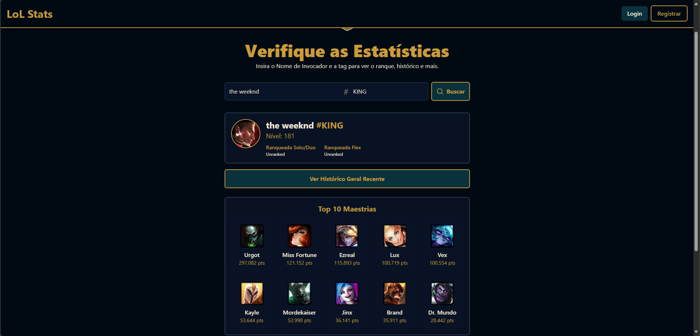

# LoL Stats - Verificador de Estatísticas de League of Legends

LoL Stats é uma aplicação web interativa construída com React e Tailwind CSS que permite aos usuários buscar estatísticas detalhadas de jogadores de League of Legends. A plataforma oferece funcionalidades de autenticação, busca de perfis, visualização de maestrias de campeões, sistema de favoritos com observações e ranking dos melhores jogadores.

## Arquitetura do Sistema


## Interface do Produto

[Interface1.pdf](https://github.com/user-attachments/files/20937498/Interface1.pdf)
[Interface2.pdf](https://github.com/user-attachments/files/20937495/Interface2.pdf)
[Interface3.pdf](https://github.com/user-attachments/files/20937496/Interface3.pdf)
[Interface4.pdf](https://github.com/user-attachments/files/20937497/Interface4.pdf)


---

## Funcionalidades Principais

- **Autenticação de Usuários**
  - Registro e login com sessão persistente (JWT).
  - Rotas protegidas (Dashboard) para usuários autenticados.

- **Busca e Visualização de Jogadores**
  - Pesquisa por Nome de Invocador e Tag.
  - Card de perfil com ícone, nome, nível e ranks Solo/Duo e Flex.

- **Análise de Campeões**
  - **Lista de Maestrias:** Top 10 campeões com maior maestria.
  - **Modal de Estatísticas Detalhadas:** Clique no campeão para ver KDA, Win Rate, CS/min e histórico de partidas recentes (com ícone, lane, role, duração, resultado).

- **História dos Campeões**
  - Modal exclusivo com splash art, nome, título, lore (história oficial) e classes (com ícones), consumindo dados diretamente do DDragon.

- **Histórico Geral de Partidas**
  - Visualização do histórico recente de partidas do jogador, com detalhes de cada partida (campeão, KDA, CS, lane, role, duração, resultado).

- **Sistema de Favoritos (Requer Login)**
  - Adicione/remova jogadores favoritos.
  - Inclua observações personalizadas ao favoritar.
  - Busca rápida por favoritos no Dashboard.

- **Ranking de Desafiantes**
  - Exibe o Top 3 do elo Desafiante em tempo real.

- **Interface Moderna e Responsiva**
  - Design com Tailwind CSS, adaptável para desktop e mobile.
  - Notificações (toasts) para feedback de ações.

---

## Tecnologias Utilizadas

- **Frontend:**
  - React
  - Vite
  - Tailwind CSS
  - React Router DOM
  - Axios
  - React Toastify

- **Backend (Dependência):**
  - Node.js/Express (para autenticação, favoritos e proxy seguro para a Riot API)
  - **Obs:** Os dados de campeões, lore e splash art são consumidos diretamente do DDragon no frontend.

---

## Pré-requisitos

- Node.js (18.x ou superior)
- npm, yarn ou pnpm
- Um backend compatível em execução para autenticação e favoritos

---

## Como Executar o Projeto

1. **Clone o repositório:**
    ```bash
    git clone <url-do-seu-repositorio>
    cd <nome-do-repositorio>
    ```

2. **Instale as dependências:**
    ```bash
    npm install
    ```

3. **Configure a URL da API:**
    - A URL base da API está definida em `src/api/Auth.jsx` e `src/api/RiotApi.jsx`.
    - Por padrão, está como `https://riot-backend.vercel.app`.  
    - Se o backend estiver em outro endereço, altere a propriedade `baseURL` nesses arquivos:

    ```js
    // em src/api/Auth.jsx
    const API = axios.create({
      baseURL: "http://localhost:3001", // Altere para a URL do seu backend
      withCredentials: true,
    });
    ```

4. **Inicie o servidor de desenvolvimento:**
    ```bash
    npm run dev
    ```
    A aplicação estará disponível em `http://localhost:5173`.

---

## Scripts Disponíveis

- `npm run dev`: Inicia o servidor de desenvolvimento com HMR.
- `npm run build`: Compila a aplicação para produção na pasta `dist`.
- `npm run lint`: Executa o ESLint.
- `npm run preview`: Visualiza a build de produção localmente.

---

## Estrutura de Pastas (`src`)

```
src/
├── api/          # Comunicação com a API (Auth, RiotApi)
├── components/   # Componentes React reutilizáveis (Header, PlayerCard, etc.)
│   └── icons/    # Componentes de ícones SVG
├── contexts/     # Contextos React (AuthContext)
├── hooks/        # Hooks personalizados (PrivateRoute)
├── pages/        # Páginas (Dashboard, Home, Login, Register)
├── App.jsx       # Componente principal
├── index.css     # Tailwind e estilos globais
└── main.jsx      # Ponto de entrada React
```

---

## Observações

- O backend deve estar rodando e acessível para autenticação e favoritos.
- Os dados de campeões, splash art e lore são consumidos diretamente do DDragon (não passam pelo backend).
- Para adicionar observações ao favoritar um jogador, utilize o campo exibido pelo Toastify ao clicar na estrela de favorito.
- O histórico geral de partidas e o Top 3 Desafiantes são atualizados em tempo real conforme a Riot
